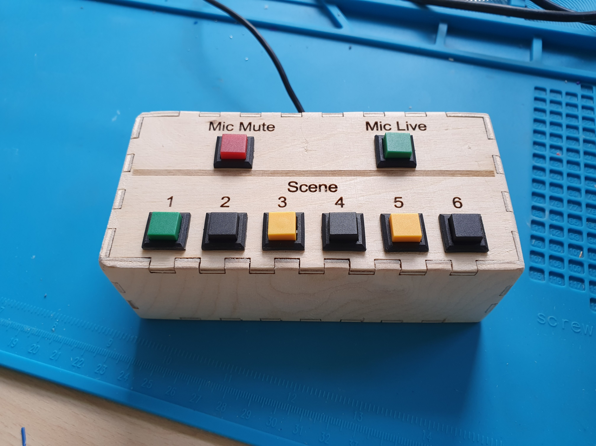
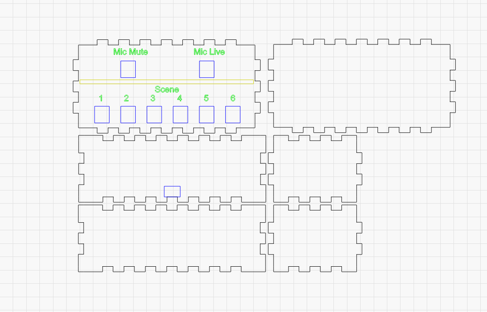

# OBS-Controller

Recently I started to join more streams during the 2020 pandemic. Not streaming myself but joining (with camera) via Discord. 

To control my video output I use OBS and virtualcam to output video to discord.

Since I want to make my life as easy as possible I created a small box to help me switch scenes and control my microphone.

Main source code can be found here: [main.cpp](src/main.cpp)

### Some overview images:
**The finished box**

**Insides of the box, it is actually very simple**

**Updated the box to have a footswitch and a USB-B connector to relief cable stress on the Arduino**

**Connectors on the backside**

**Overview of connections**

**Small overview schematic**

**Lasercutter view**

